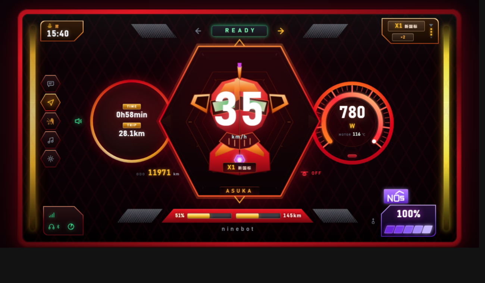
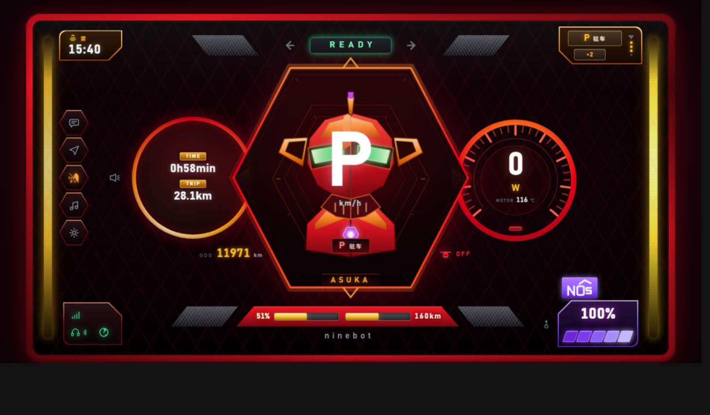
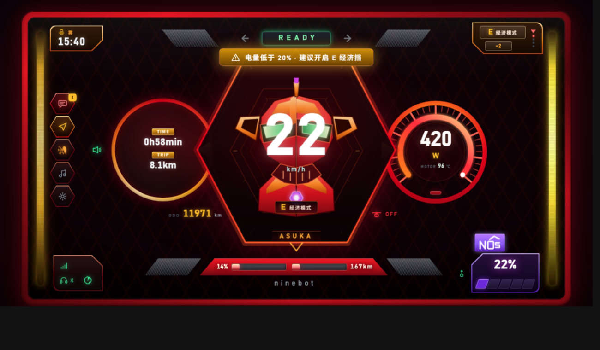
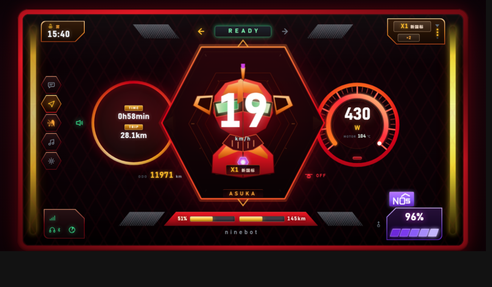
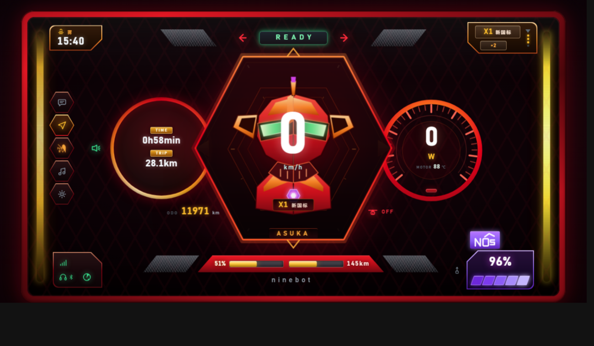
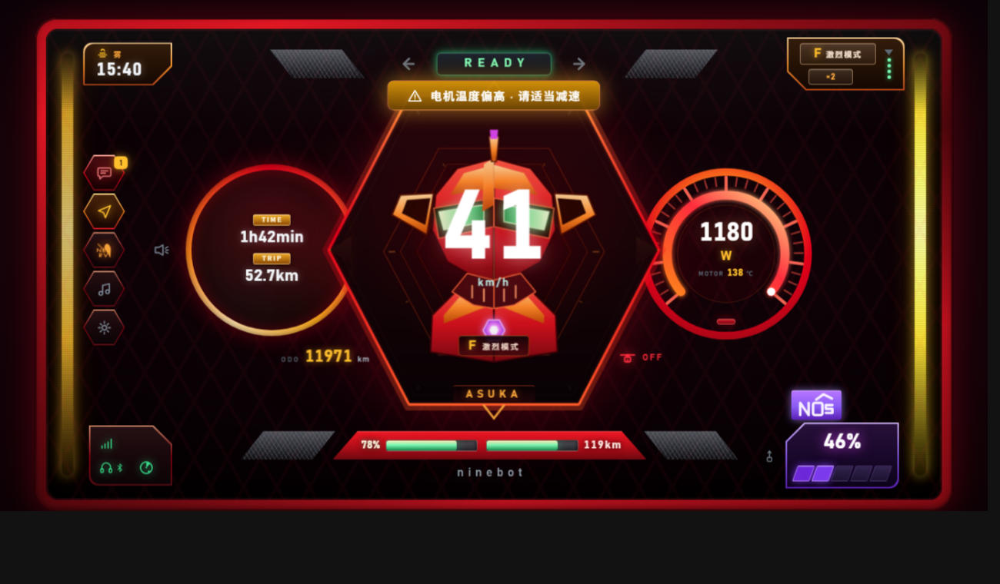
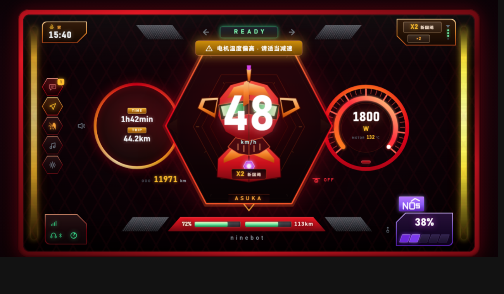
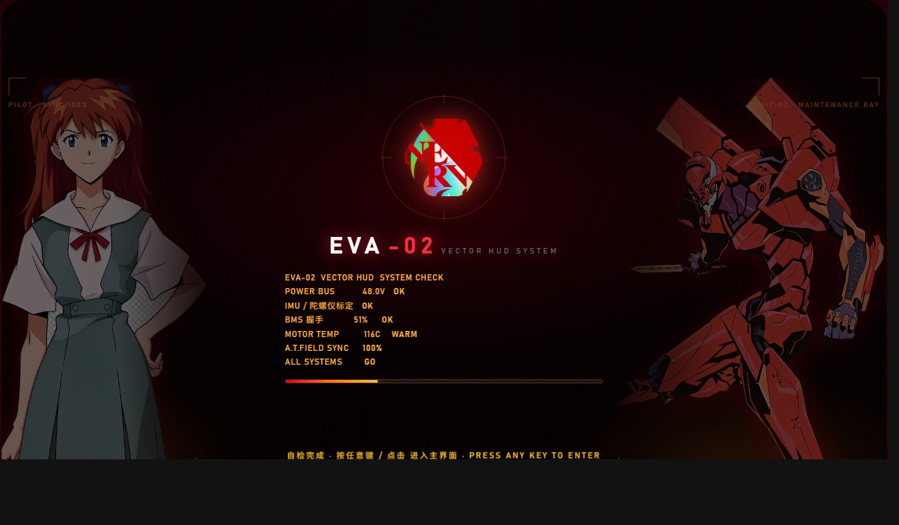
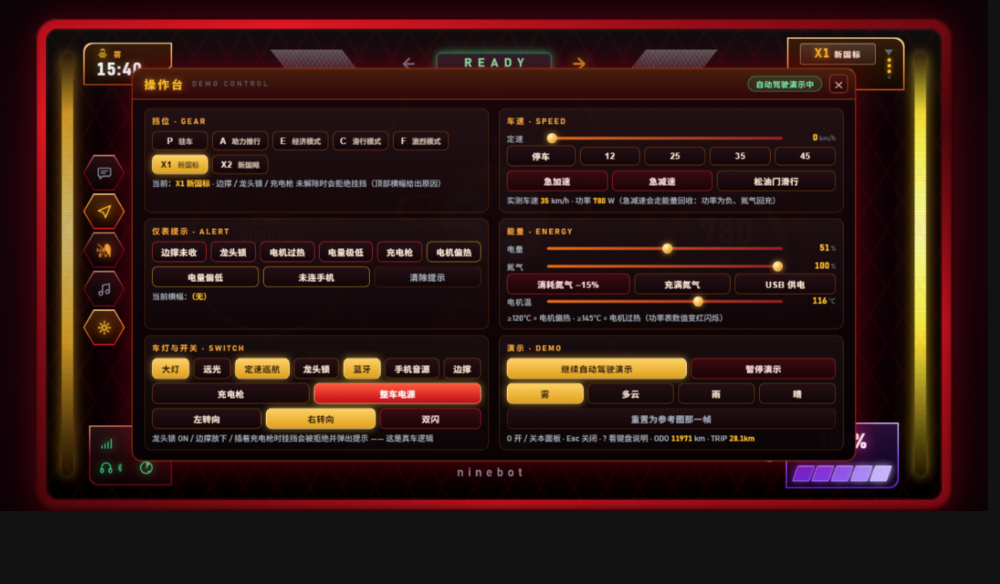

# EVA-02 HUD · 机械师二代「明日香」联名款风格智能仪表

用 **Vue 3 + Vite** 复刻的电动车智能仪表界面：EVA 红机身、琥珀色读数、
中央**平顶六边形**机甲核心（压在左右两个**等大的粗描边圆盘**之上）、
底栏**双电电量条（并列一排，垫在红色梯形框上）**、
右下角**紫色不规则五边形 NOS 氮气条**（`NOS` 字标用 SVG 画在框外侧）、
左侧 **5 个平顶六边形功能芯片**，以及四个角落**互为镜像的缺角五边形芯片**
（切角一律朝屏幕中心）。**左/右转向灯与双闪**贴在 `READY` 铭牌左右两侧。



| 停放上电（= 参考照片那一帧） | 低电量告警（红闪 + 横幅 + 消息芯片） |
| --- | --- |
|  |  |

| 左转（左箭头亮） | 右转（右箭头亮） | 双闪（左右一起红闪） |
| --- | --- | --- |
|  |  |  |

| F 激烈模式（78% 绿色档） | 四位数功率（数值牌自动降字号） | 开机自检 |
| --- | --- | --- |
| 激烈 | 四位数 | 开机 |
| --- | --- | --- |
|  |  |  |

| 操作弹框（点按钮决定演示什么） |
| --- |
|  |

> 原始参考照片放在 `prototype/eva2.png`，逐项对应关系见 `DESIGN.md` 第 6 节。

---

## 快速开始

环境要求：**Node ≥ 18**（这台机器上 nvm 里已经有 20.17.0）

```bash
nvm use 20.17.0      # 默认那个 14.17 跑不了 Vite 5，构建脚本会提前拦住并提示
npm install
npm run dev          # → http://127.0.0.1:5173（自动打开浏览器）
```

| 命令 | 作用 |
| --- | --- |
| `npm run dev` | Vite 开发服务器（热更新） |
| `npm run build` | 构建到 `dist/`（相对路径产物，可直接双击 `dist/index.html`） |
| `npm run preview` | 本地预览构建产物 |
| `npm run check` | 静态自检（语法 / 组件 / 图标契约 / DOM id / CSS 变量 / 立绘预留位 / 旧结构残留） |
| `npm run smoke` | 冒烟测试（核心仿真 900 帧 + 无头浏览器渲染断言） |
| `npm run art` | 立绘预备：`src/assets/` 里的白底图 → 抠成透明底 + 裁掉透明边，写进 `src/assets/art/` |
| `npm run shot` | 出图到 `docs/preview.png`（`npm run shot:park` 出停放帧） |
| `npm test` | check + smoke |

> **旧启动方式已废弃**：`server.js` 删掉了。开发交给 Vite 自己的 dev server，
> 预览交给 `vite preview`，`tools/` 里只剩自检 / 冒烟 / 出图三个脚本。

---

## 技术栈与目录结构

```
eva2-hud/
├─ index.html                  Vite 入口（只有 <div id="app">，DOM 全在组件里）
├─ vite.config.js              base:'./' + @vitejs/plugin-vue + es2019 目标
├─ src/
│  ├─ main.js                  入口：createApp(App).mount('#app')
│  ├─ App.vue                  ★ 外壳与三段式布局骨架（provide 出整台「仪表」）
│  ├─ config.js                ★ 所有可调参数：分辨率、刷新率、车辆参数、文案、芯片清单
│  ├─ core/                    纯 JS 逻辑层，零 Vue 依赖（可被 Node 直接 import 测试）
│  │  ├─ state.js              ★ 车辆状态模型 + 物理仿真 + 演示自动驾驶 + 告警裁决
│  │  ├─ input.js              键盘 → cmd 指令（createInput() 工厂，可 dispose）
│  │  ├─ emblem.js             六边形外框 + 机甲徽记（原创几何，返回 SVG 字符串）
│  │  ├─ artslot.js            开机自检页**立绘预留位**：把 config 里的图名解析成构建后的 URL
│  │  ├─ gauges.js             功率圆表（SVG）+ 分段色条（DOM）
│  │  └─ icons.js              内联 SVG 图标精灵（21 个图标：天气 4 + 指示灯 / 功能 16 + NOS 字标）
│  ├─ assets/art/              ★ 立绘预留位：自检页两侧的图丢这里（文件名写进 config.boot.art）
│  │                            白底图先跑 `npm run art` 抠成透明底（tools/cutout.js）
│  ├─ composables/
│  │  └─ useHud.js             ★ 「仪表大脑」：状态 + 主循环 + 显示快照 + 等比缩放 + 出图模式
│  ├─ components/              每个零件一个 .vue（**样式也各自写在自己的 <style scoped> 里**）
│  │  ├─ TopBar.vue            天气+时间 / 左转向← READY →右转向 / 骑行挡位徽标
│  │  ├─ LeftRail.vue          左侧 5 个平顶六边形芯片：消息·导航·NERV·音乐·设置
│  │  ├─ TimeDial.vue          TIME / TRIP 粗描边圆盘（外径 240）
│  │  ├─ CoreHex.vue           中央平顶六边形：P/时速 + 挡位铭牌 + ODO + 龙头锁
│  │  ├─ PowerGauge.vue        右侧功率圆表（粗环 + 数值弧 + 自动宽度数值牌 + 电机温度）
│  │  ├─ BottomBar.vue         左下信号五边形 + 红色梯形双电条 + ninebot + 紫色 NOS 框 + USB
│  │  ├─ WarningBanner.vue     顶部告警横幅
│  │  ├─ HelpPanel.vue         按键说明浮层（? 开关）
│  │  ├─ ControlPanel.vue      ★ 操作弹框（O 开关）：挡位 / 车速 / 仪表提示 / 氮气 / 急加速 急减速
│  │  └─ BootOverlay.vue       开机自检动画（时长 / 等按键见 config.boot 的 minMs · waitEnter；两侧立绘见 boot.art）
│  └─ styles/base.css          **唯一**的公共样式表：设计令牌 / 重置 / 机身外壳 / 屏幕质感 / 共享零件
├─ tools/
│  ├─ check.js                 静态自检
│  ├─ smoke.js                 冒烟测试（纯 Node 仿真 + 无头浏览器 DOM 断言 + 几何契约）
│  ├─ probe.html               探针（量 rect / clip-path 顶点 / 计算底色 / class，还能派发 click·按键·在页面里求值，以及轮询等条件；喂给 smoke.js）
│  ├─ shot.js                  出图（本机 Chrome / Edge 无头截图）
│  ├─ pixel.js                 设计走查：把参考图放大 / 转成 ASCII 色块图（零依赖）
│  ├─ cutout.js                立绘预备：白底 PNG → 透明底 + 裁透明边，写进 src/assets/art/（零依赖）
│  └─ node-check.js            构建前的 Node 版本闸门
├─ docs/                       预览图
└─ prototype/                   设计参考图
   ├─ eva2.png                 实车仪表照片（逐项对应见 DESIGN.md 第 6 节）
   └─ nerv.jfif                NERV 标志（左侧灯塔第 3 个图标照着它画）
```

---

## 样式分工（组件自己的样式写在自己的 `<style scoped>` 里）

这条是 v4 起的硬约束，按 Vue 项目的惯例：

| 放哪儿 | 放什么 |
| --- | --- |
| `src/styles/base.css`（**唯一**的公共表） | 设计令牌 `:root`、基础重置、舞台 / 机身外壳 / 屏幕质感（`.stage .bezel .screen .strip .fx`）、**共享零件**（`.ico` / `.chip--*` / `.chipbg` / `.mesh` / `blinkHard`·`pulseGlow` 等公共 keyframes） |
| 各组件 `.vue` 的 `<style scoped>` | 这个组件自己的全部样式（顶栏 / 灯塔 / 圆盘 / 核心 / 功率表 / 底栏 / 横幅 / 帮助 / 开机 / **操作弹框**），App.vue 还负责三段式骨架与子组件根节点的定位 |

* 判断标准只有一句：**只被一个组件用的 → 写在那个组件里；被 ≥2 个组件用的 → 才进 base.css。**
* 子组件根节点会带上父组件的 scope 属性，所以 `App.vue` 里可以直接写 `.rail / .core / .timedial / .side` 给它们定位置。
* 由 `v-html` 注入或 JS 生成的 SVG（`emblem.js` 的 `.cf-*` / `.em-*`、`gauges.js` 的 `.g-*` / `.bar__seg`）**拿不到 scope 属性**，组件里统一用 `:deep()` 选（漏了就是「节点在、样式没来」—— NOS 斜条曾经整条隐形就是这个原因）。
* ⚠ **通配选择器会压过子元素自己的定位**：`.xxx> :not(.chipbg)` 的权重是 (0,3,0)，比 `.nosmark[data-v]` 的 (0,2,0) 高 → 会把本该 `position:absolute` 的节点压成 `relative`（NOS 字标曾因此退回文档流占 41px，把 `100%` 和斜条挤出框）。抬内容层要**点名**写。
* `@keyframes` 写在 scoped 块里时 Vue 会连动画名一起改名（互不撞名）；跨组件的公共动画留在 base.css，scoped 规则直接引用原名。
* 数字读数的 `tabular-nums` + `font-family: var(--font-num)` 由各组件自己声明 —— 公共表不再写「跨组件的类名清单」。
* 迁移 / 大改样式时的自检套路：把「旧文件」与「新文件 + 各 .vue 的 style 块」都解析成
  `选择器 → 声明集合`，做一次**规则级 diff** —— 该为零丢失（本轮迁移就是这么核对过的）。

---

## 分层：三层，单向依赖

```
config.js          数据（阈值 / 配色 / 文案 / 芯片清单）
   ↓
core/*.js          纯逻辑：Vehicle.create / update / autoDrive / warnings   ← 完全不碰 DOM
   ↓
composables/useHud.js   每帧把逻辑推进 + 生成「显示快照」
   ↓
components/*.vue        只读快照，负责画
```

**两条渲染通道**（沿用原实现的性能策略，做了 Vue 化改造）：

1. **60fps 通道**：功率弧、NOS 格子这类连续量。组件在 `onMounted` 里
   `registerFrame(fn)` 注册回调，回调里**直接写 SVG 属性**，不经过 Vue 的 diff。
2. **8Hz 通道**：所有数字 / 文字 / 指示灯。汇总成一个 `reactive` 快照（`hud.view`），
   由 Vue 负责 diff —— 值没变就不碰 DOM，长时间跑不掉帧。

---

## 界面构成（与参考图逐项对应）

| 区域 | 内容 |
| --- | --- |
| 顶栏左 | **天气 + 时间**（同一块芯片：上一行天气图标 `雾/晴/多云/雨`，下一行时间）—— **左上圆角 + 右下切角** |
| 顶栏中 | **左转向灯 ← `READY / CHARGING / CHECK` 铭牌 → 右转向灯**（双闪时左右一起闪）；两侧各垫一块**灰黑斜纹平行四边形** —— 离铭牌左右都 46px、**共用同一条水平中线**（`--mesh-dy: 0`）、形状互为镜像（`╲ READY ╱`），所以两块永远**一样高、严格对称** |
| 顶栏右 | **骑行挡位徽标**：当前挡位 + `×2`（不再写「模式」），右侧一列 **倒三角 + 4 圆点**，全在同一块芯片里且内框比外框小一圈（**右上圆角 + 左下切角**） |
| 左灯塔 | **5 个平顶六边形**：消息 · 导航 · NERV · 音乐 · 设置 |
| 中央 | TIME / TRIP 粗描边圆盘 ‖ **平顶六边形核心（绝对居中，压在两个圆盘之上）**：P / 时速 + 机甲徽记 + 挡位铭牌 + `ASUKA` ‖ 近光灯 |
| 六边形左下斜边 | **ODO 总里程** |
| 六边形右下斜边 | **龙头锁开关 OFF（红）/ ON（琥珀）** |
| 右侧 | **POWER 功率圆表**（粗描边整圆 + 260° 刻度 + 数值弧 + 挡位名 + 电机温度 + RECUP）；中央数值装在**自动宽度的圆角牌**里，四位数也不出圈 |
| 底栏左 | **一整块不规则五边形**：网络信号（左上）+ 耳机带蓝牙（左下）+ **GPS 雷达盘（右下：圆盘 + 扇形扫描波 + 回波点）** —— **左下圆角 + 右上切角** |
| 底栏中 | **双电两条并列一排**（左条 = 容量 `51%`，右条 = 续航，右端写满电 `145km`）垫在**红色梯形背景框**上，左右各一块**灰黑斜纹平行四边形**（与红框等高、同中线、左右镜像）+ `ninebot` |
| 底栏右 | **紫色不规则五边形 = NOS 氮气条**：框内**上半 `100%` 读数、下半一条 5 格斑马纹斜条**（每格 20%、高 22px、`skewX(-20deg)`，节点由 `gauges.js` 生成）—— **右下圆角 + 左上切角**；`NOS` 字标是 **SVG 几何字（os 上方带箭头）挂在五边形外侧**；旁边是 USB 指示灯 |

> 四个角落的芯片互为镜像：**切角一律朝屏幕中心，圆角留在屏幕外角**。

---

## 第八轮改版修正（本次）

| # | 反馈 | 实现 |
| --- | --- | --- |
| 1 | 自检页那个**环里的六边形内部要显示 NERV** | 新增 `config.boot.mark`「徽记预留位」：`BootOverlay.vue` 的 `<svg class="boot__ring">` 里加一层 `<clipPath id="boot-mark-clip">`（顶点直接用 `hexPts` 那一份）+ `<image class="b-mark" clip-path="url(#boot-mark-clip)">`。图还是按文件名从 `src/assets/art/` 取（`core/artslot.js`，默认 `nerv2.png`），所以**只可能在六边形里出现**、绝不可能越界。默认 `fit: 'cover'` + `scale: 1.2` → 铺满并轻微放大（图自己那圈圆形边界被裁掉、字母更大），`opacity: .92` + `drop-shadow` 红光；`is-armed` 时**绕环心**缩放淡入（`transform-box: view-box` + `transform-origin: 120px 120px`），`prefers-reduced-motion` 下直接显示、不缩放 |
| 2 | 留空 / 图名写错不能崩，也不能又变成一块白板 | 同一套安静降级：`src` 留空 → 六边形里什么都不画；名字写错 → 不画 + 控制台一条 `[boot.mark]` warn；`npm run check` 多一条「环里徽记（六边形内部）→ src/assets/art/nerv2.png（RGBA 1900×1970）」（art / mark 三个槽共用同一段检查）。`nerv2.png` 也是**白底不透明** PNG → 先过 `npm run art` 抠底（`tools/cutout.js` 的「没点名就按 config 处理」现在把 `boot.mark.src` 一起算上） |
| 3 | 别糊掉六边形的描边；不透明度不能被入场动画吃掉 | 图层顺序定死「圈 → 徽记 → `.b-hex` 描边 → 刻度」：描边画在图**之后**（探针 `order` 断言盯着，否则图会盖掉内半条边）。不透明度走 `--mark-o` 而**不写进 keyframes** —— 动画里 `to { opacity: 1 }` 的优先级高于行内样式、会盖掉配置值；所以入场动画只动 `transform`（`from { transform: scale(.88); opacity: .2 }`，`to` 不写 opacity = 落回 `--mark-o`） |

这一轮的测试契约（改坏立刻 FAIL）：`tools/probe.html` 新增 `order`（文档顺序断言，
`order=A~B` = 先 A 后 B、B 在上层），并把 SVG `<image>` 的 `svgHref` / `par`
（preserveAspectRatio）/ `clipId` / `clipPts`（clip-path 那层 `clipPath` 里 `<polygon>`
的顶点数）一起量出来；`imgdims` 也从「只认 `background-image`」扩成
「`background-image` 或 `<image>` 的 href」。于是「用的是 config 里那张图」
「**真能解码出 1900×1970**」「被裁进一个 **6 顶点**的多边形」
「铺满 / 缩进 = `config.boot.mark.fit`」「六边形描边画在徽记**之上**（文档顺序）」
「徽记与六边形同心、框 = 六边形包围盒 × `scale`」「不透明度 / 混合模式来自配置」
「`?mark=off` 真的不画」这 11 条都进了冒烟测试（smoke 147 → 159 项）。

⚠ 新踩的坑：`order` 的分隔符**不能用 `<`**。探针要把结果写进本页 `title`，而
`chrome --dump-dom` 会把 title 里的 `<` 转义成 `&lt;` → 冒烟拿到的键对不上、
断言假 FAIL（第一版就是这么挂的，换成 `~` 才对上）。

**顺手补上的键盘链路断言**（smoke 159 → 162 项）：`tools/probe.html` 又多了三个参数
—— `key=`（派发 keydown + keyup）、`keyDown=`（只按下不松手）、`js=`（在 iframe 里
求值），于是「按 `O` 能开操作弹框 / 再按 `Esc` 能关」也进了冒烟。这条断言来由一个真
实故障：`App.vue` 的 `import` 还在、但模板里的 `<ControlPanel />` 被漏掉 → 按 `O` 时
`panelOpen` 翻成 `true`、DOM 里却什么都没有（这就是「O 键打开配置的功能没了」）。
只断言 `?panel=1`（URL 打开）抓不到按键链路，所以两条都留着。

---

## 第七轮改版修正

| # | 反馈 | 实现 |
| --- | --- | --- |
| 1 | 开机自检页太空，想在背景两侧加**立绘**：左边驾驶员、右边机体，而且要从屏幕外**划入** | 新增 `src/core/artslot.js` + `src/assets/art/` 组成的**立绘预留位**：`BootOverlay.vue` 里两层 `.boot__art--l / --r` 钉在屏幕外缘（`left/right: -24px`），`@keyframes bootArtIn` 从 `translateX(±46%)` 划入（方向由 `--art-dir` 取符号，`slideMs: 900`，右侧 `--art-delay: 60ms`），`fill-mode: both` 停在最后一帧。图从 `src/assets/art/` 里按文件名取，用 `import.meta.glob` 在构建期展开成「名字 → 带哈希的 URL」，所以：换图只改 config 一行、没人引用的图不进包、名字写错时这一侧**安静地不显示**（不会出现碎图标） |
| 2 | 立绘要**融进背景**、不挡读数、不弄坏擦除 | ① 融合：朝屏幕中心一侧 `mask-image: linear-gradient(...)` 羽化 + `--art-o` 控不透明度 + `drop-shadow` 红光（`blend: 'screen'` 是备选的全息口感）；② 不挡读数：立绘是 `.boot` 的**绝对定位子层**（`position: absolute` + `z-index: 0`）→ 不参与 flex 排流，中列文字后面再加 `.boot__scrim` 压暗（`scrim: .55`），层级收口成「立绘 0 < 能量线 1 < 压暗层 2 < 文字 3」（`.boot__ring/__title/__log/__bar` 点名抬到 3）；③ 擦除：因为就在 `.boot` 内部，跟着 `.is-done` 的 `clip-path` 一起被擦走，零额外代码；④ 立绘框的细节照旧：四角锁定框、脚下地面辉光、A.T. 力场六边形涟漪、自上而下扫过一次的扫描线；`is-hold` 时立绘极慢内移 + 辉光呼吸；`prefers-reduced-motion` 下直接显示、不划入 |
| 3 | 图是**白底不透明 PNG**，铺到黑底 HUD 上就是两块白板 | 新增零依赖的 `tools/cutout.js`（`npm run art`）：**只吃「和四条边连通」的亮中性色**（内部白色——比如白衬衫——被线稿挡在泛洪区外，所以不是粗暴的全局色键），允许渐变生长吃掉 222~235 的灰白晕影（碰到线稿的大跳变就停），泛洪区外沿再按亮度给一次半透明做抗锯齿，最后裁掉透明边；`--map` 会打一张 ASCII 透明度图 + 残留统计，方便换图时对阈值 |
| 4 | 开关 / 换图 / 调参要方便 | `config.boot.art`：`enabled`（关掉 = 纯文字自检页）、`left/right.src`（**文件名**从 `src/assets/art/` 取；也可以写 `./art/x.png`（`public/`）或 URL（CDN）；**留空 = 这一侧不渲染**，也就是「预留位」本来的样子）、`w` / `opacity` / `blend` / `flip`（水平镜像）/ `tag`（角上小标签）、`slideMs`、`scrim`。地址栏临时覆盖：`?art=off`（关）/ `?art=1`（开）。`npm run check` 会在构建前就把「图名对不上」「图没抠白底（PNG 无 alpha）」拦下来 |
| 5 | （顺手修掉的两处不一致） | 文档里 `waitEnter` 还写着 `false`（`config.js` 已是 `true`）→ 改文档并让 `waitEnter` 的提示行断言按配置分支；`smoke.js` 那条「停留期提示行给出还有几秒」假 FAIL 随之消失 |

这一轮把上一版「用 `bootart.js` 生成原创几何剪影」整个换成了**放图**：`src/core/bootart.js`
已删除，`BootOverlay.vue` 里那套 `:deep(.baU-*) / :deep(.baP-*)` 配色也一并清掉 ——
内容现在全在图片里，组件只负责「位」。

这一轮的新契约（改坏立刻 FAIL）：`tools/probe.html` 除了多返回
`position / z-index / opacity / mix-blend-mode / animation-name / fill-mode / 时长 / left / right / mask-image`，
还会**把测到的 `background-image` 真加载一次**，返回 `imgdims`（宽×高，挂掉是 `FAIL` / `TIMEOUT`）。
于是「立绘是绝对定位层、不参与 flex 排流」「开/关立绘时中列日志的位置尺寸**逐像素一致**」
「左右划入方向相反（左从左边进、右从右边进）」「用的是 config 里填的那张图」
「**那张图真的能解码出真实像素尺寸**（路径没写错、构建也把它带上了）」
「镜像 / 不透明度 / 混合模式都来自配置」「上一版的几何剪影彻底退场（0 张 SVG）」
「层级 0 < 1 < 2 < 3」「`?art=off` 真的不渲染」这 22 条都进了冒烟测试。

---

## 第六轮改版修正

| # | 反馈 | 实现 |
| --- | --- | --- |
| 1 | 开机自检页想**停久一点**（比如 3s），而且这个等待要**可配置** | `config.boot` 加两个开关：`minMs: 3000` —— 从页面出现算起**最少停 3s**（日志约 2s 写完 → 写满后再停约 1s 才红闪擦除进主界面；想「写满后再停 3s」就设 `5000` 左右）；`waitEnter: true` —— 不自动进入，停在「按任意键 / 点击 进入主界面」等一次人工操作（改回 `false` 就是写满后自动进入，那时停留期提示行会显示「还有几秒」）。地址栏还能临时覆盖（不用改代码）：`?boot=5000`（毫秒）/ `?boot=wait` / `?boot=0`（立刻进） |
| 2 | GPS 的 SVG 图标要**雷达那种形状** | `#i-gps` 重画成雷达盘：圆盘 + 一条**扇形扫描波**（右上）+ 圆心枢轴点 + 一个**目标回波点**（右下）；元素分居不同象限，22px 下也不会糊成一团（不再是地图大头针） |
| 3 | 右下角**氮气条还是没生成好**（只看到 `100%`，斜条不见了） | 两个真凶都揪出来了：① 斜条是 `gauges.js` 用 JS 建的 `<i class="bar__seg">`，**拿不到 scope 属性**，所以 `.bar__seg` 那条规则根本没命中 → 整条色带是隐形的（改成 `.nosbox__segs :deep(.bar__seg)`）；② `.nosbox> :not(.chipbg)` 的权重 (0,3,0) **压过**了 `.nosmark` 的 `position:absolute`，把「NOS」字标压回文档流占了 41px → `100%` 和斜条被挤出框外、色带被压成 2px（改成**点名** `.nosbox__pct / .nosbox__segs`）。顺带按参考图重排：上半 `100%`、下半一条 22px 高的斑马纹色带，斜条角度 `-20deg` |

这两条通病（**JS 生成的节点必须 `:deep()`**、**通配选择器会压过子元素自己的定位**）现在都有断言兜着：
`tools/probe.html` 会返回计算底色 / class / 行内 width，而且能**轮询等条件成立再量**（`when=` / `whenGone=`），
所以「斜条真的画出来了」「写满后仍停在自检页」「`?boot=wait` 会一直等着」这几件事改坏就会 FAIL。

---

## 第五轮改版修正（照着实车照片与开发体验逐条改）

| # | 反馈 | 实现 |
| --- | --- | --- |
| 1 | 启动页**进度条和自检文本叠在一起** | `.boot__log` 不再写死 96px（7 行文字 143px 装不下 → 溢出压到了进度条）：框高改成 `calc(var(--boot-rows) * 1.7em)`，`--boot-rows` = `config.boot.lines.length`（改配置自动跟着变）；再加 `overflow-y: auto` + 隐藏滚动条 + 「真的溢出才加」的底部淡出 + 写完一行就 `scrollTop = scrollHeight` 自动跟随。smoke 里断言「文本域底 ≤ 进度条顶」 |
| 2 | `READY` 左右的 mesh「**还是没做好平行四边形**」，而且两块要**对称 + 等高** | 真凶是上一轮的 `±15px` 上下错位（实测左块比铭牌低 14px、右块高 14px）→ 顶栏一对改成 `--mesh-dy: 0`，与底栏一致**共用同一条中线**；形状继续由镜像多边形令牌 `--mesh-slash`(╱) / `--mesh-slash-r`(╲) 保证「上下边等长 + 左右斜边等长」；同时把这几条写成**几何契约测试**（`tools/probe.html` + smoke），以后谁改坏立刻 FAIL |
| 3 | CSS 按 Vue 的惯例拆：**组件样式写进各自的 `<style scoped>`**，只有公共的才单独列文件 | 删掉 `styles/layout.css` / `components.css` / `boot.css`（三个零件大杂烩），规则按归属原样搬进 11 个 `.vue`；`base.css` 只留令牌 / 重置 / 机身外壳 / 屏幕质感 / 4 个共享零件；`.cf-*` `.em-*` `.g-*`（v-html / JS 生成的 SVG）改用 `:deep()`；等宽数字等跨组件类名清单拆回各组件；`check.js` 支持 `<style scoped>` 并从行内 `:style` 收集运行期变量 |
| 4 | 想要一个**操作弹框**：点按钮自己决定现在演示什么 | 新增 `ControlPanel.vue`：**挡位**（P/A/E/C/F/X1/X2）、**车速**（滑杆 + 停车/12/25/35/45）、**急加速 / 急减速 / 松油门滑行**、**仪表提示**（8 条告警 + 清除）、**电量 / 氮气 / 电机温度**滑杆、**消耗氮气 −15% / 充满氮气**、8 个车灯开关 + 边撑 / 充电枪 / 整车电源、左/右转向 + 双闪、天气、**自动驾驶 继续 / 暂停**、一键回到「参考图那一帧」。写入全部复用真车通路：`send(cmd)` → `input.push()` → `state.update()`，油门脉冲 `hold()`，直接量写 `vehicle` + `refresh()`；面板一动自动暂停自动驾驶演示 |
| 5 | （顺手修掉的既有问题） | `smoke.js` 两条长期 FAIL 的断言（功率表底部挡位名早已下线 / 图标数量阈值差 1）已修；`check.js` 的 id 契约不再把 HTML 注释里的 id 算进去 |

**操作弹框怎么开**：键盘 <kbd>O</kbd>、左灯塔最下面那颗「设置」六边形芯片点一下、
或地址栏加 `?panel=1`（出图 / 冒烟测试用）。关闭：<kbd>O</kbd> / <kbd>Esc</kbd> / 右上角 ✕。

---

## 第四轮改版修正（照着实车照片逐条改）

| # | 反馈 | 实现 |
| --- | --- | --- |
| 1 | 两块 `battgauge__track` 的 div **必须始终一样大** | 两条电量条改成同一套 grid：左行「读数 + 轨道」、右行「轨道 + 读数」，轨道都落在 `1fr` 列；两侧读数槽改成固定 62px（原来 `min-width`，读数一变长就会挤窄轨道）→ 任何状态下两个轨道尺寸完全一致 |
| 2 | 底栏 `mesh--bl` / `mesh--br` 要**互相对称**、与 `.battgauge::before` **等高** | 尺寸/形状收进 base.css 三个令牌：`--mesh-w` / `--mesh-h`（= 红梯形框高 = `.battgauge` 高度）/ `--mesh-sk`；`.battgauge` 与装饰块共用 `--mesh-h` → 永远等高 |
| 3 | 两对 `mesh` 都要**平行和对称** | 形状改用一对镜像多边形令牌 `--mesh-slash`(╱) / `--mesh-slash-r`(╲)（每块都是真平行四边形），位置统一 `top:50% + translateY(-50% + --mesh-dy)`：底栏一对 `--mesh-dy: 0`（同一中线）、顶栏一对 `±15px`（相反数 → 参考照片的 `╲ READY ╱`），离铭牌左右都 46px；底栏右侧那块正名为 `--br`。**⚠ 第五轮反馈：顶栏这对 `±15px` 错位看起来并不对称，已改成 `0`（共用同一条中线、严格镜像）** |
| 4 | 满电续航读数应为 `145km` | `.battgauge__cap#v-range-max` 从 `view.rangeText` 改回 `view.rangeMax`；中间两块备注（`容量` / `74.0km`）保持不渲染 → 两条电量条紧挨中间、读数在两端，与参考图一致 |

---


## 第三轮改版修正（照着实车照片逐条改）

| # | 反馈 | 实现 |
| --- | --- | --- |
| 1 | 转向灯应该放在 **`READY` 的左右两侧**，并演示**左转 / 右转 / 双闪**三个场景 | `.topbar__c` = 左箭头 ← READY → 右箭头；`lamps.hazard` 新增双闪（左右一起闪，红琥珀色）；`A` / `F` / `H` 键与演示自动驾驶的三个场景都补齐；出图姿态 `--pose=left/right/haz` |
| 2 | 中间那个**温度图标不要了** | 删掉 `.lamp--temp` 与环境温度读数、删掉 `i-thermo` 图标（电机温度仍在功率圆表里显示） |
| 3 | 左下角三个图标位置：**信号左上 / 耳机蓝牙左下 / GPS 右下** | `config.cluster[].slot` 决定格位，`.clusterbox__ico.is-tl / is-bl / is-br` 三处定位 |
| 4 | `READY` 左右、电量条左右都该有**灰黑色带斜细纹的平行四边形**（之前漏了） | 新增 `.mesh`（交叉斜纹 + 灰黑渐变 + 平行四边形 clip-path），共 4 块：顶栏 2（左低右高）+ 底栏 2 |
| 5 | 电量条应该在**梯形的红色背景框**下面 | `.battgauge::before` = 左边缘斜切的红色梯形底框，两条电量条用 `.battgauge__rows` 压在它上面 |
| 6 | 功率到四位数（>999）会突出圆环 → 改成跟 TIME / RANGE 左侧那对牌子一样的圆角牌 | `.gauge__plate` 自动宽度 + `len-3 / len-4 / len-5` 逐级降字号；`W` 单位单起一行（和参考图一样在数字下方） |
| 7 | `NOS` 字样用 **SVG** 实现（`os` 上面还有一道箭头，纯文本做不出来），并且要放在**五边形外侧** | 新增 `#i-nos` 图标（N 折线 / O 圆角框 / S 折线 + OS 上方箭头），`.nosmark` 定位在五边形上沿之外（`bottom: calc(100% + 4px)`） |
| 8 | 右上角「`×2 模式`」的「模式」是多余的；内框还压到了外五边形 | `brand.dualMode` 改成 `×2`；`.gearchip` 加大 padding、两块内铭牌固定 `min-width` 且不再顶到外框 |
| 9 | 左右两个圆和六边形的距离：原图里是**六边形压住圆形**（有重叠） | `.timedial` / `.side` 的定位改为「距中线 190px」，两个圆各向中心挪 112px；`.core` 加 `z-index: 3` 压在上面 |
| 10 | 两侧黄色灯条**太细太窄**，上下也要留出距离 | `.strip` 从 9px → **16px**，上下内缩 16px → **34px**，左右内缩 10px → **22px** |

> 顺带：左侧圆盘的两行改成参考图那样的「金色标签牌 + 白色读数」（`TIME` / `TRIP`）。

---

## 第二轮改版修正（照着实车照片逐条改）

| # | 反馈 | 实现 |
| --- | --- | --- |
| 1 | 左上角那个图标不是我让你设计的，原图只有 **天气 + 时间**（上天气下时间） | 删掉骑行状态芯片与 `i-helmet`，改成 `.timechip`：第一行琥珀天气图标 + 天气文字，第二行 25px 时间 |
| 2 | 右上角多了「定速续航」之类的三个按钮；`新国标 + ×2 模式` 框格式不对，**倒三角和 4 个点被放到了框外** | 删掉三个功能灯芯片；新增 `.gearchip`，三角 + 4 圆点回到同一块芯片内右侧 |
| 3 | 左下角应该是**一个五边形**装 网络信号 / 耳机蓝牙 / GPS；切角位置错了；四个角的五边形要对称 | 合并成一整块 `.clusterbox.chip--bl`；四角芯片统一为「切角朝屏幕中心、圆角朝屏幕外角」的镜像四件套 |
| 4 | 氮气条应该是**像电量那样的紫色不规则五边形**，不该放到框外 | `.nosbox.chip--br`：紫色框架内 `NOS` 标签 + `100%` + 5 条紫色斜条；原先外置的 NOS 条与 `BATT` 紫框合并成一块 |
| 5 | 中间大型六边形**旋转角度错了**，上下两条边要平行于屏幕横向 | `--hex` / `.core__hex` / `emblem.js#buildFrame()` 全部改成平顶六边形（470×440） |
| 6 | 左右两个状态圆圈**大小不一** | 两个圆外径统一 240px（左侧 `conic-gradient` 环 + 右侧 SVG 粗环） |
| 7 | 五个六边形也要调整旋转角度 | `.hexchip` 改成平顶六边形（58×50，间隙 4px，照片里几乎相接） |
| 8 | 挡位是 A 助力推行 / E 经济 / C 滑行 / F 激烈 / X1 新国标 / X2 新国飚，要显示在**中间那个大六边形里面**，切换挡位时六边形要有**心跳动画**（变小再变大） | 六挡写进 `config.vehicle.gears`；六边形内部加挡位铭牌；换挡时 `.core` 播 `coreBeat`（1 → 0.88 → 1.015 → 1，0.56s）；右上角徽标就是当前挡位 |
| 9 | 龙头锁 OFF 应该是**红色**而不是灰色 | `.core__lock` 默认红色 + 红色辉光，ON 才转琥珀 |

> 顺带把「告警三角」从底栏挪到了左侧**消息**芯片：有告警时红灯闪烁 + 角标 `1`，
> 与顶栏 `CHECK` 铭牌、顶部横幅组成三重冗余。
>
> 上一轮（10 条：单一大字槽、灯塔图标、六边形、双电并列、五边形轮廓、右上徽标、
> 左下三芯片、ODO 位置、龙头锁、Vue 3 迁移）见 `DESIGN.md` 第 8 节的「第一轮」。

---

## 仪表语义

* **六边形永远在屏幕正中**，且**压在左右两个圆盘之上**：`z-index` 上 `.core`(3) >
  `.timedial` / `.side`(1)，所以两个圆各自有 45px 伸进六边形下面 —— 与实车照片一样有重叠。
  左右两侧元素全部绝对定位、不参与排流，所以六边形不会偏心。
* **两个圆一样大**：左侧 TIME / TRIP 圆盘（`conic-gradient` 外环）与右侧功率表
  （SVG 粗环）外径都是 **240px** 上下 —— 参考图里两个圆等大。
* **转向灯**：贴在 `READY` 铭牌左右两侧；`A` 打左、`F` 打右、`H` 开双闪。
  单边转向 45s / 300m 自动回位（`config.turnAuto`），开双闪会自动取消单边转向，
  双闪不会自动熄灭（要再按一次 `H`）。
* **灰黑斜纹平行四边形**（`.mesh`，4 块：顶栏 `--tl/--tr`、底栏 `--bl/--br`）：
  尺寸与角度只有三个令牌（`--mesh-w / --mesh-h / --mesh-sk`），其中 `--mesh-h` 与
  红梯形框（`.battgauge::before`）等高；
  每块都是真平行四边形（上下边水平等长、左右斜边同斜率），一对左右严格镜像 ——
  底栏一对同一中线（`--mesh-dy: 0`）、顶栏一对**也共用同一条中线**（`--mesh-dy: 0` ——
  参考照片那种「上下错位」在实机上看并不对称，第五轮已按反馈取消）；离铭牌左右都 46px；
  纯装饰、`pointer-events: none`。
* **双电电量条**（底栏中间、并列一排、垫在红色梯形框上）：
  * 左条 = **容量**（读数在条左端 `51%`），右条 = **续航**（读数在条右端，显示满电 `145km`）；
    两条共用同一套 grid → **尺寸永远一致**，中间紧挨、读数分列两端（与参考图一致）。
  * 填充部分 **黄/绿/红 = 还没用完的**，灰色槽 = 已经用完的。
  * 颜色只看 SOC：**> 60% 绿**、**20%~60% 黄**、**< 20% 红（闪烁）**，
    阈值在 `src/config.js` 的 `socBar: { high: 60, low: 20 }`。
* **NOS 氮气条**：右下角紫色不规则五边形里的 **5 格斑马纹斜条**（每格 = 20%，
  高 22px、`skewX(-20deg)`，格子节点是 `gauges.js` 用 JS 建的 → 组件里的规则
  必须写成 `.nosbox__segs :deep(.bar__seg)`，漏了 `:deep()` 整条色带就是隐形的），
  `state.nos` 在大功率输出时消耗（-3.5%/s），制动回收 / 滑行时回充
  （见 `src/core/state.js` 的 update）。
  `NOS` 字标是 SVG 几何字（`#i-nos`），**绝对定位**挂在五边形外侧上方。
* **GPS 图标**（左下角芯片组第 3 个，`#i-gps`）是**雷达盘**：圆盘 + 扇形扫描波 +
  圆心枢轴点 + 目标回波点。
* **电机温度**显示在功率圆表中心（数值牌下方），≥120℃ 琥珀、≥145℃ 红闪，
  同时触发告警横幅。
* **龙头锁**：`K` 键或演示流程切换；**OFF 是红色**（未锁），ON 转琥珀，
  上锁时挂挡会被拒绝并弹 `LOCKED` 告警。
* **骑行挡位**：`A` 助力推行 / `E` 经济 / `C` 滑行 / `F` 激烈 / `X1` 新国标 /
  `X2` 新国飚，plus `P` 驻车。当前挡位同时出现在**中央六边形内的铭牌**、
  **右上角徽标**和**右侧圆表底部**；换挡时中央六边形做一次心跳缩放。

---

## 按键控制

页面加载完先播一段开机自检动画：默认**进度条写满后再停满 3s** 才擦除进主界面
（停留时长见 `config.boot.minMs`；`config.boot.waitEnter = true` 或地址栏 `?boot=wait`
会改成「按任意键 / 点击 进入主界面」；`?boot=0` 立刻进）。任意键 / 点击可随时跳过，
随后进入**演示自动驾驶**（起步 → 巡航 → 减速转弯 → 换模式 → 低电充电；其中转向灯按
**左转 / 右转 / 双闪** 三个场景轮番上演）。按任意键即接管，**松手 6 秒后自动交还演示**。

| 按键 | 功能 |
| --- | --- |
| `W` / `↑` | 加速 |
| `S` / `↓` | 制动（负功率 → 触发能量回收 + RECUP 呼吸） |
| `空格` | 松油门滑行 |
| `1` `2` `3` `4` `5` `6` | 骑行挡位：A 助力推行 / E 经济 / C 滑行 / F 激烈 / X1 新国标 / X2 新国飚 |
| `G` | 换下一挡位（中央六边形会做一次心跳缩放） |
| `P` | 驻车 P 挡（行车中挂 P 会被拒绝） |
| `A` `F` | **左 / 右转向灯**（READY 铭牌左右两侧的箭头，闪烁，300m 或 45s 自动回位） |
| `H` | **双闪**（左右箭头一起闪，再按一次关闭；开双闪会自动取消单边转向） |
| `L` | 大灯 |
| `K` | **龙头锁** OFF / ON（上锁时挂挡会被拒绝并弹 `LOCKED` 告警） |
| `C` `B` `U` | 定速巡航 / 蓝牙 / USB 供电 |
| `Y` | 手机音源开 / 关（左侧「音乐」芯片随之点亮） |
| `X` | 边撑（放下时挂挡会被拒绝） |
| `V` | 插拔充电枪（插枪时禁止行驶，电量开始回升，龙头锁自动上锁） |
| `M` | 开 / 关演示自动驾驶 |
| `O` | **操作弹框**开 / 关（点按钮设定挡位 / 车速 / 仪表提示 / 氮气 / 急加速 急减速…；左灯塔「设置」芯片也能开） |
| `Esc` | 关闭操作弹框 |
| `?` | 显示或关闭按键说明（左侧「设置」芯片同时点亮） |

---

## 操作弹框（ControlPanel）

想自己决定「现在演示什么」就按 <kbd>O</kbd>（或点左侧灯塔最下面那颗「设置」六边形），
弹框里所有按钮都**复用真车那套规则**，不另造假状态：

| 分组 | 有什么 | 底层走哪条路 |
| --- | --- | --- |
| 挡位 · GEAR | `P` 驻车 / `A` `E` `C` `F` `X1` `X2` | `send({ gear })` → `shiftGear()`：边撑 / 龙头锁 / 充电枪 未解除会被**拒绝并告警** |
| 车速 · SPEED | 定速滑杆（0~60）、停车 / 12 / 25 / 35 / 45、**急加速** / **急减速** / 松油门滑行 | 写 `cruiseSpeed` 让物理去逼近 + 油门脉冲 `hold(±1, ~2.5s)`（急减速会走能量回收：功率为负、氮气回充） |
| 仪表提示 · ALERT | 边撑未收 / 龙头锁 / 电机过热 / 电量极低 / 充电枪 / 电机偏热 / 电量偏低 / 未连手机 + 清除提示 | `send({ forceWarn })`：同一条告警表 → 横幅 + `READY` 铭牌 + 左上「消息」芯片三处一起响应 |
| 能量 · ENERGY | 电量滑杆、氮气滑杆、**消耗氮气 −15%**、充满氮气、USB 供电、电机温度滑杆 | 直接写 `soc / nos / motorTemp` + `refresh()`（连续量） |
| 车灯与开关 · SWITCH | 大灯 / 远光 / 定速巡航 / 龙头锁 / 蓝牙 / 手机音源 / 边撑 / 充电枪 / 整车电源 + 左转向 / 右转向 / 双闪 | 与键盘完全同一条 `cmd` 通路 |
| 演示 · DEMO | 继续自动驾驶演示 / 暂停演示、天气（雾 多云 雨 晴）、**重置为参考图那一帧** | `vehicle.auto.enabled`；重置 = 把 `config.seed` 写回 |

> 面板一动就会**暂停自动驾驶演示**（否则几秒后它会把挡位、车速改回去），
> 顶部那颗状态胶囊会显示当前是「演示中」还是「已暂停」。地址栏加 `?panel=1`
> 可以直接带着弹框出图（`docs/preview-panel.png` 就是这么来的）。

---

## 接入真实车辆数据

`src/core/state.js` 里的字段就是仪表契约。把外部数据（CAN / BLE / WebSocket）
按同样字段名写进 `hud.vehicle`，然后关掉演示自动驾驶即可 —— **渲染层一行都不用改**：

```js
// src/App.vue
const hud = createHud();

hud.vehicle.auto.enabled = false;          // 关闭演示
hud.vehicle.speed     = frame.speedKmh;    // km/h
hud.vehicle.power     = frame.powerW;      // W，负值 = 能量回收
hud.vehicle.soc       = frame.batteryPct;  // 0~100（双电表颜色档位靠它）
hud.vehicle.auxSoc    = frame.auxPct;      // 副电（USB 供电会掉电，不单独上屏）
hud.vehicle.nos       = frame.nosPct;      // 右下角紫色氮气条 0~100
hud.vehicle.gear      = frame.gear;        // 'P' | 'A' | 'E' | 'C' | 'F' | 'X1' | 'X2'
hud.vehicle.weather   = frame.weather;     // 'fog' | 'cloud' | 'rain' | 'sun'
hud.vehicle.lamps.turnL = frame.turnLeft;  // 指示灯
hud.vehicle.lamps.lock  = frame.steerLock; // 龙头锁（六边形右下斜边）
hud.vehicle.media.playing = frame.mediaPlaying;
```

调试时也可以在浏览器控制台直接改：`EVA_HUD.vehicle.speed = 30`
（`createHud()` 会把上下文挂到 `window.EVA_HUD`）。

数据不是 60fps 来的也没关系：`update()` 只是「推进一帧」，外部可以按自己的节奏
写字段，渲染层照旧按两条通道刷新。告警想走自己的策略，替换
`src/config.js` 的 `warnings` + `src/core/state.js` 的 `warnings()` 即可。

---

## 自定义

| 想改什么 | 改哪里 |
| --- | --- |
| 配色、字体、发光强度、芯片轮廓 | `src/styles/base.css` 的 `:root` 令牌 |
| 分辨率、刷新率、车速/功率/温度模型、阈值、告警文案 | `src/config.js` |
| 左侧 5 个芯片 / 左下 3 个芯片的内容与顺序 | `src/config.js` 的 `rail` / `cluster` |
| 中央机甲徽记 | `src/core/emblem.js`，或把 `build()` 的返回值换成 `<image href="assets/core.png" .../>` |
| 开机自检页两侧立绘（**预留位**） | `src/config.js` 的 `boot.art`：`enabled` 开关、`left/right.src`（**填 `src/assets/art/` 里的文件名**，例如 `'asuka_stand.png'`；也可以写 `./art/xxx.png`（`public/`）或 URL；**留空 = 这一侧不显示**）、宽度 / 不透明度 / 混合模式 / 镜像 / 角标文案 / 划入时长 / 压暗强度。换图三步：① 白底图丢进 `src/assets/` ② `npm run art` 抠成透明底并写进 `src/assets/art/` ③ 把文件名填进 `boot.art.left/right.src` |
| 图标 | `src/core/icons.js`，保持 `symbol id` 不变替换图形即可 |
| 按键 | `src/core/input.js` 的 `tap()` / `commands()` |
| 某个零件的样式与结构 | 对应的 `src/components/*.vue`（**样式也在同一个文件里**，`<style scoped>`） |

字体优先用系统里的 **Bahnschrift / DIN Alternate**（最接近原厂仪表的数字字形），
没有时依次回退 Roboto Condensed → Segoe UI → 无衬线。

---

## 开发工具

```bash
npm run check     # 静态自检 75 项
npm run smoke     # 冒烟测试 162 项（核心仿真 34 + 渲染 DOM 与几何契约 128）
npm run shot      # 出图到 docs/preview.png
npm test          # check + smoke
```

* `check` 会检查：`src/` 与 `tools/` 的 JS 语法、每个 `.vue` 的结构与
  `<script setup>` 语法、图标契约（用到的 `#i-x` 必须已定义，且不能有没人用的）、
  DOM id 唯一性与 `tools/smoke.js` 的 id 契约（**先剥掉 HTML 注释**，注释里的 id 不算）、
  **旧结构残留**（`js/` `css/` `server.js` 必须已经清掉、`src/` 里不能再出现 `EVA.*` 全局）、
  CSS 变量是否有定义（组件的 `<style scoped>` 也一起扫，行内 `:style` 注入的变量自动豁免）。
* `smoke` 第一段**不依赖浏览器**：直接 import `src/core/state.js` 跑 900 帧物理，
  断言里程 / 告警 / 龙头锁 / 氮气消耗回充这些规则；第二段用无头浏览器打开
  `dist/index.html`（先 `npm run build`）断言真实 DOM；**第三段是几何契约**：
  `tools/probe.html` 把仪表页面装进同源 iframe，量出每个元素的 rect 与
  `clip-path` 顶点（`%` 折算成 px）写进自己的 `title`，smoke 用 `--dump-dom` 读回来断言
  「4 块斜纹块真平行四边形 / 左右严格镜像 / 同中线 / 与红框等高 / 到中线等距 /
  开机自检文本域不压进度条 / 操作弹框按钮数与不越界」。没装 Chrome 会自动跳过。
  探针还支持**按条件触发**（`when=` 等某选择器出现、`whenGone=` 等它消失）、
  **计算样式**（底色 / class / 行内 width）、**派发点击与按键**（`click=` / `key=`；
  `keyDown=` 只按下不松手，用来复现「keyup 丢了 → 这个键以后按下没反应」），
  以及**在 iframe 里求值**（`js=`，例 `js=[EVA_HUD.input.keys,EVA_HUD.panelOpen.value]`
  —— 「监听到底绑上没有」「状态翻没翻」这类问题光看 DOM 看不出来）——
  因为虚拟时间下 CSS 过渡不推进，「写满后是否仍在自检页」「JS 生成的斜条是否真被
  样式命中」这类断言要靠它们。⚠ `key=` / `click=` 都在**条件就绪、开始量之前**才派发，
  且**超时分支不派发**：不然会往「还没挂载的页面」里按键，测出来的全是假象。
* `shot` 会自动寻找 Chrome / Edge，也可以用环境变量 `CHROME_PATH` 指定路径；
  `--query=panel=1` 可以把操作弹框一起拍进去；拍开机自检要连 `--query=boot=8000`
  一起用（把「停留时长」拉长，出图才稳定停在写满那一帧），例如
  `--pose=park --query=boot=8000 --ms=2850`。
* `pixel.js` 是这次逐像素比对参考图留下的走查工具（零依赖，自带 PNG 解码器）：

  ```bash
  node tools/pixel.js crop  --x=94 --y=70 --w=64 --h=48 --z=16 --name=tl   # 放大局部
  node tools/pixel.js map   --x=90 --y=62 --w=100 --h=64 --step=1          # 转 ASCII 色块图
  node tools/pixel.js runs  --y=200 --h=12 --thr=85                        # 逐行亮像素区间（量宽度/位置）
  node tools/pixel.js edges --x=130 --y=95 --w=115 --h=120 --thr=75        # 逐行亮像素统计
  ```

  产物写在 `docs/_*`（已被 .gitignore 忽略）；`--in=` 可指向任意 PNG，
  默认读 `prototype/eva2.png`。

### 出图模式（设计走查用）

给 URL 加 `?photo=字段:值,字段:值` 可以**冻结画面**（跳过开机动画、不跑主循环），
方便截图对比：

```
dist/index.html?photo=speed:35,power:780,gear:X1,soc:51,motorTemp:116,lamp.turnR:1
dist/index.html?photo=soc:78,nos:60,rangeFull:145,rangeKm:113     # 看绿色档
dist/index.html?photo=gear:F,weather:rain                         # 换挡 + 换天气
dist/index.html?photo=turn:left                                   # 左转向（right / hazard 同理）
dist/index.html?photo=power:1800,gear:X2                          # 四位数功率：数值牌自动降字号
```

`tools/shot.js` 内置了 10 种姿态：

```bash
node tools/shot.js --pose=cruise     # 巡航中（默认，挡位 X1 新国标）
node tools/shot.js --pose=park       # 上电静止（= 参考照片那一帧）
node tools/shot.js --pose=charge     # 充电中（龙头锁 ON）
node tools/shot.js --pose=lowbatt    # 低电量（红条 + 横幅 + 消息芯片）
node tools/shot.js --pose=full       # F 激烈模式 / 78% 绿色档
node tools/shot.js --pose=left       # 左转向（READY 左侧箭头亮）
node tools/shot.js --pose=right      # 右转向
node tools/shot.js --pose=haz        # 双闪（左右箭头一起红闪）
node tools/shot.js --pose=bigpower   # 四位数功率 1800W（看数值牌降字号）
node tools/shot.js --pose=off        # 未上电
node tools/shot.js --pose=park --scale=2 --out=docs/big.png   # 2 倍分辨率
node tools/shot.js --pose=cruise --query=panel=1 --out=docs/preview-panel.png  # 带操作弹框
node tools/shot.js --pose=park --query=boot=8000 --ms=2850 --out=docs/preview-boot.png  # 开机自检「写满后停留」那一帧
node tools/shot.js --pose=park --query=boot=wait --ms=3200 --out=docs/boot-wait.png  # 自检页停住等按键那一帧
node tools/shot.js --pose=park --query=boot=wait\&art=off --ms=3200 --out=docs/boot-noart.png  # 关掉两侧立绘（纯文字版）
```

开机自检的「等多久」也能用地址栏改（不动代码，出图 / 演示时很顺手）：

```
dist/index.html?boot=8000      # 自检页停满 8s 再进主界面
dist/index.html?boot=wait      # 写满后停住，等一次按键 / 点击才进（= config.boot.waitEnter）
dist/index.html?boot=0         # 立刻进主界面（调试别的功能时省时间）
```

---

## 浏览器要求

Chrome / Edge 90+、Firefox 90+、Safari 15+。
只用到 `clip-path`、CSS 自定义属性、`<use href>`、`style.setProperty('--var')`
这类早已标准化的特性。窗口缩放时整个仪表等比缩放（设计基准 1280×688）。

---

## 声明

* 本项目的**美术部分（机甲徽记、图标、六边形外框、芯片轮廓）全部为原创几何图形**，
  只借用了「EVA-02 红 / 橙 / 琥珀配色 + 机甲头盔」这一整体风格 ——
  唯一的例外是按 `prototype/nerv.jfif` 参考图重画的 NERV 小图标（示意性简化），
  不含任何官方插画、logo 矢量或字体文件。
* 「ninebot」「机械师」「Evangelion / NERV」等商标归各自权利人所有。
  本项目仅用于个人学习与界面设计练习，请勿作商业用途。
